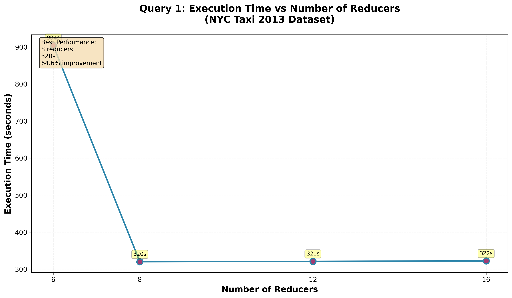

# Query 1 Performance Analysis
## Most Popular Routes (NYC Taxi 2013)

***

## Experiment 1: Number of Reducers

### Results
| Reducers | Time (s) | vs. Baseline |
|----------|----------|--------------|
| 6 | 904 | - |
| 8 | 320 | **-64.6%** |
| 12 | 321 | -64.5% |
| 16 | 322 | -64.4% |

### Key Findings

- **Optimal configuration:** 8 reducers (320 seconds)
- **Performance breakthrough:** 6 → 8 reducers yields 2.83× speedup (584 seconds saved)
- **Plateau effect:** Beyond 8 reducers, performance remains flat (~320s) indicating cluster saturation
- **Interpretation:** The 3-node cluster reaches optimal parallelism at 8 reducers; additional reducers add coordination overhead without performance gains

***

## Experiment 2: Slow Start Parameter

### Results

| Slow Start | Time (s) | vs. Best |
|-----------|----------|----------|
| 0.25 | 316 | +106.5% |
| 0.50 | 327 | +113.7% |
| 0.75 | **153** | - |
| 0.95 | 157 | +2.6% |

### Key Findings

- **Optimal configuration:** 0.75 (153 seconds)  
- **Counter-intuitive result:** Later reducer start (0.75) outperforms early starts by 113.7%
- **Narrow optimal range:** 0.75-0.95 both perform well; early starts (0.25-0.50) incur significant penalties
- **Interpretation:** Starting reducers at 75% map completion minimizes resource contention while enabling efficient shuffle operations

***

## Conclusions

1. **Combined optimization essential:** Optimal performance (153s) requires both 8 reducers AND 0.75 slow start—a **5.9× improvement** over baseline (904s)

2. **Critical thresholds exist:** Reducer count shows sharp improvement then saturation; slow start exhibits non-linear optimization curve

3. **Resource matching matters:** Performance limits align with cluster capacity (8 reducer slots), not just algorithm parallelism

**Recommended Configuration:** 8 reducers, 0.75 slow start, ~153 second execution time

***

# Query 2 Performance Analysis
## Most Expensive Routes (NYC Taxi 2013)

***

## Experiment 1: Number of Reducers

### Results

| Reducers | Time (s) | vs. Baseline |
|----------|----------|--------------|
| 6 | 150 | - |
| 8 | 156 | +4.0% |
| 12 | 160 | +6.7% |
| 16 | 175 | **+16.7%** |

### Key Findings

- **Optimal configuration:** 6 reducers (150 seconds)
- **Inverse performance relationship:** Unlike Q1, increasing reducers degrades performance
- **Linear degradation:** Each additional reducer tier adds ~5-10 seconds overhead
- **Interpretation:** Query 2's workload (finding maximum fares vs. counting frequencies) has less parallelizable work; additional reducers create more coordination overhead than benefit

***

## Experiment 2: Slow Start Parameter

### Results

| Slow Start | Time (s) | vs. Best |
|-----------|----------|----------|
| 0.25 | **163** | - |
| 0.50 | 239 | +46.6% |
| 0.75 | 195 | +19.6% |
| 0.95 | 166 | +1.8% |

### Key Findings

- **Optimal configuration:** 0.25 (163 seconds)
- **Inverted curve:** Early reducer start (0.25) performs best—opposite of Q1's 0.75 optimum
- **Significant mid-range penalty:** 0.50 configuration shows worst performance (239s), 46.6% slower than optimal
- **Narrow optimal range:** Both extremes (0.25 and 0.95) perform similarly well; mid-range values incur substantial overhead
- **Interpretation:** Query 2's aggregation pattern (max finding) benefits from early reducer start, allowing incremental max computation during map phase

***

## Conclusions

1. **Query-specific optimization:** Q2 exhibits opposite tuning characteristics from Q1—fewer reducers (6) and earlier slow start (0.25) yield best results

2. **Workload characteristics matter:** Maximum-finding operations (Q2) benefit from different resource allocation than frequency counting (Q1)

3. **Mid-range penalty:** Both experiments show performance degradation at intermediate values, suggesting threshold-based behavior rather than linear scaling

**Recommended Configuration:** 6 reducers, 0.25 slow start, ~150-163 second execution time

**Comparison to Q1:** Q2 completes faster overall (150-175s vs. 320-904s) due to simpler aggregation logic but shows less scalability with additional resources

***

# Query 3 Performance Analysis
## Most Visited Locations (NYC Taxi 2013)

***

## Experiment 1: Number of Reducers

### Results

| Reducers | Time (s) | vs. Best |
|----------|----------|----------|
| 6 | **179** | - |
| 8 | 188 | +5.0% |
| 12 | 179 | +0.0% |
| 16 | 190 | +6.1% |

### Key Findings

- **Optimal configurations:** 6 and 12 reducers (both 179 seconds)
- **Bimodal performance:** Two distinct optimal points suggest workload distribution effects
- **Minimal variation:** Total range is only 11 seconds (5.8% spread), indicating reducer count has limited impact
- **Interpretation:** Query 3's dual-output nature (separate pickup/dropoff tracking) creates balanced workload across most reducer configurations, reducing sensitivity to parallelism levels

***

## Experiment 2: Slow Start Parameter

### Results

| Slow Start | Time (s) | vs. Best |
|-----------|----------|----------|
| 0.25 | **180** | - |
| 0.50 | 248 | +37.8% |
| 0.75 | 242 | +34.4% |
| 0.95 | 240 | +33.3% |

### Key Findings

- **Optimal configuration:** 0.25 (180 seconds)
- **Sharp performance drop:** Moving from 0.25 to 0.50 causes 68-second degradation (37.8% slower)
- **Flat late-start performance:** Values 0.50-0.95 cluster tightly around 240-248s with minimal variation
- **Two-tier behavior:** Clear separation between early start (180s) and late start (~240s) configurations
- **Interpretation:** Query 3 benefits decisively from early reducer allocation, likely due to double mapper output volume (emitting both pickup and dropoff per record) requiring early shuffle pipeline activation

***

## Conclusions

1. **Reducer insensitivity:** Unlike Q1 and Q2, reducer count shows minimal performance impact (5.8% range), suggesting workload naturally balances across configurations

2. **Critical slow start threshold:** Performance bifurcates sharply at 0.25-0.50 boundary; early start essential for this query's doubled output volume

3. **Consistent late-start penalty:** All late-start values (≥0.50) incur ~33-38% overhead, indicating resource contention from deferred reducer allocation

**Recommended Configuration:** 6 or 12 reducers, 0.25 slow start, ~179-180 second execution time

**Query Characteristic:** Q3's dual-location tracking doubles map output volume compared to Q1/Q2, making early reducer start critical despite reduced reducer count sensitivity

---

# Query 4 Performance Analysis
## Nightlife Spots 8PM-2AM (NYC Taxi 2013)

***

## Experiment 1: Number of Reducers

### Results

| Reducers | Time (s) | vs. Best |
|----------|----------|----------|
| 6 | **110** | - |
| 8 | 117 | +6.4% |
| 12 | 132 | +20.0% |
| 16 | 136 | +23.6% |

### Key Findings

- **Optimal configuration:** 6 reducers (110 seconds)
- **Consistent linear degradation:** Performance steadily worsens with each increase in reducer count
- **Maximum penalty:** 16 reducers runs 23.6% slower than optimal (26-second overhead)
- **Interpretation:** Q4's filtered dataset (nightlife hours only: ~30-35% of total records) has insufficient data volume to benefit from high parallelism; fewer reducers minimize coordination overhead for smaller workload

***

## Experiment 2: Slow Start Parameter

### Results

| Slow Start | Time (s) | vs. Best |
|-----------|----------|----------|
| 0.25 | **125** | - |
| 0.50 | 126 | +0.8% |
| 0.75 | 129 | +3.2% |
| 0.95 | 126 | +0.8% |

### Key Findings

- **Optimal configuration:** 0.25 (125 seconds)
- **Minimal impact:** Total variation only 4 seconds (3.2% range)—smallest slow start sensitivity across all queries
- **Near-flat performance:** All configurations cluster tightly around 125-129 seconds
- **Symmetric distribution:** Both early (0.25) and late (0.95) starts perform equally well; mid-range (0.75) slightly worse
- **Interpretation:** Reduced data volume (nightlife-only filtering) makes slow start parameter nearly irrelevant; shuffle phase too small to benefit from timing optimization

***

## Conclusions

1. **Smallest workload, lowest optimal parallelism:** Q4's time-filtered dataset (8PM-2AM) benefits most from minimal reducer count (6), contrasting with Q1-Q3

2. **Slow start insensitivity:** 3.2% variation indicates timing parameter has negligible impact on this query's smaller shuffle volume

3. **Fastest absolute execution:** Q4 completes in 110-136 seconds—fastest across all queries due to ~65-70% data reduction from time filtering

**Recommended Configuration:** 6 reducers, 0.25 slow start, ~110-125 second execution time

**Query Characteristic:** Time-based filtering (8PM-2AM) drastically reduces dataset size, making Q4 more sensitive to reducer overhead than parallelism benefits—opposite behavior from full-dataset queries (Q1-Q3)